In this assignment we learn how to assess rates from a binomial distribution, using the case of assessing your teachers’ knowledge of CogSci
--------------------------------------------------------------------------------------------------------------------------------------------

N.B. there is a second part at the bottom for next week.

### First part

You want to assess your teachers’ knowledge of cognitive science. “These
guys are a bunch of drama(turgist) queens, mindless philosophers,
chattering communication people and Russian spies. Do they really know
CogSci?”, you think.

To keep things simple (your teachers should not be faced with too
complicated things): - You created a pool of equally challenging
questions on CogSci - Each question can be answered correctly or not (we
don’t allow partially correct answers, to make our life simpler). -
Knowledge of CogSci can be measured on a scale from 0 (negative
knowledge, all answers wrong) through 0.5 (random chance) to 1 (awesome
CogSci superpowers)

This is the data: - Riccardo: 3 correct answers out of 6 questions -
Kristian: 2 correct answers out of 2 questions (then he gets bored) -
Josh: 160 correct answers out of 198 questions (Josh never gets bored) -
Mikkel: 66 correct answers out of 132 questions

Questions:

1.  What’s Riccardo’s estimated knowledge of CogSci? What is the
    probability he knows more than chance (0.5) \[try figuring this out.
    if you can’t peek into chapters 3.1 and 3.2 and/or the slides\]?

-   First implement a grid approximation (hint check paragraph 2.4.1!)
    with a uniform prior, calculate the posterior and plot the results
-   Then implement a quadratic approximation (hint check paragraph
    2.4.2!).
-   N.B. for the rest of the exercise just keep using the grid
    approximation (we’ll move to quadratic approximations in two
    classes)

``` r
### GRID APPROXIMATION ####
#define the grid
p_grid <- seq(from = 0 , to = 1 , length.out = 10000) #1 and 0 becasue 0 would be no answers correct, 1 would be all answers correct
bin_size <- abs(p_grid[1] - p_grid[2])

#define the prior
prior <- rep(1, 10000) #Flat, multiply all parameters with 1, because we assume we don't know anything

#test the prior
dens(rbinom(10000, 6, runif(10000, 0, 1))) #6 becasue 6 outcomes
```


``` r
#likelihood at each value in grid, takeing into account the data
#Riccardo: 3/6
likelihood <- dbinom(3, size = 6 , prob = p_grid)
samples <- sample(p_grid, prob = likelihood, size = 1e4, replace = TRUE)
dens(samples)
```


``` r
#compute posterior 
unstd_posterior <- likelihood*prior

#standardize posterior 
posterior <- unstd_posterior/sum(unstd_posterior * bin_size)

#draw the plot of the posterior
d <- data.frame(grid = p_grid, posterior = posterior, prior = prior, likelihood = likelihood)
ggplot(d, aes(grid,posterior)) + 
      geom_point() +
      geom_line() +
      theme_classic()+ 
      geom_line(aes(grid, prior),color= 'red')+ 
      xlab("Knowledge of CogSci") + 
      ylab("Density") +
      ggtitle("Figure 1: Posterior of grid approximation for Riccardo with uniform prior")
```


``` r
### QUADRATIC APPROXIMATION ###
globe_qa <-
  rethinking::map(alist(
      w ~ dbinom(6, p),  # binomial likelihood
      p ~ dunif(0, 1)),    # uniform prior)
      data = list(w = 3))
globe_qa
```

    ## 
    ## Maximum a posteriori (MAP) model fit
    ## 
    ## Formula:
    ## w ~ dbinom(6, p)
    ## p ~ dunif(0, 1)
    ## 
    ## MAP values:
    ##   p 
    ## 0.5 
    ## 
    ## Log-likelihood: -1.16

``` r
# display summary of quadratic approximation
precis(globe_qa)
```

    ##   Mean StdDev 5.5% 94.5%
    ## p  0.5    0.2 0.17  0.83

``` r
#50% chance that he's better than chance
```

1.  Estimate all the teachers’ knowledge of CogSci. Who’s best? Use grid
    approximation. Comment on the posteriors of Riccardo and Mikkel. 2a.
    Produce plots of the prior, and posterior for each teacher.

``` r
#make function 
grid_approx <- function(teacher_name, teacher_correct, teacher_all){
  p_grid <- seq(from = 0 , to = 1 , length.out = 1e4) #define grid
  prior <- rep(1, 1e4)
  dens(rbinom(1e4, teacher_all, runif(1e4, 0, 1)))
  likelihood <- dbinom(teacher_correct , size = teacher_all , prob = p_grid)
  unstd.posterior <- likelihood*prior
  bin_size <- bin_size <- abs(p_grid[1] - p_grid[2])
  posterior <- unstd.posterior / sum(unstd.posterior*bin_size)
  #print(posterior)
  d <- data.frame(grid = p_grid, posterior = posterior, prior = prior, likelihood = likelihood)
  ggplot(d, aes(grid,posterior)) + 
      geom_point() +
      geom_line() +
      theme_classic()+ 
      geom_line(aes(grid, prior),color= 'red')+ 
      xlab("Knowledge of CogSci") + 
      ylab("Density") +
      ggtitle(teacher_name)}
  
grid_approx("Riccardo", 3, 6) #Riccardo
```

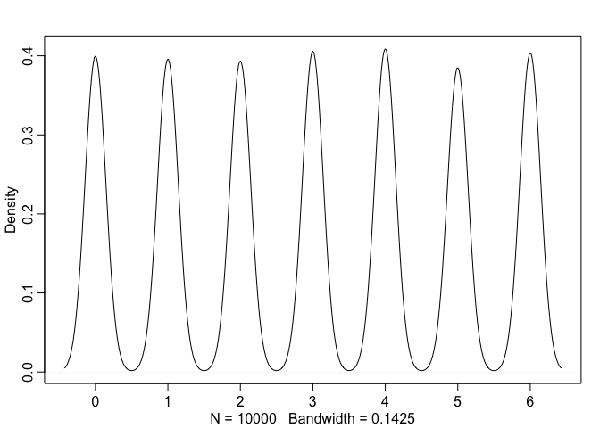

``` r
grid_approx("Kristian", 2,2) #Kristian
```

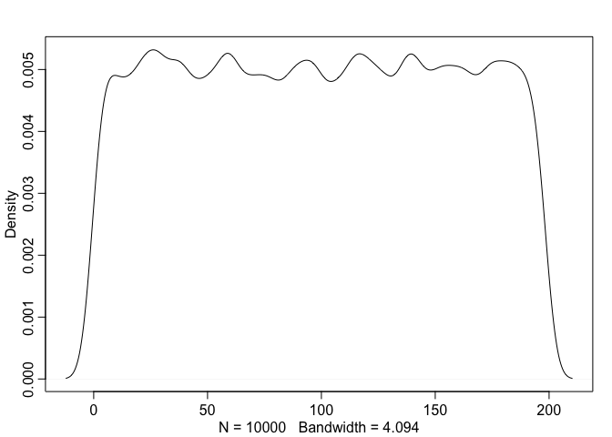

``` r
grid_approx("Josh", 160,198) #Josh
```

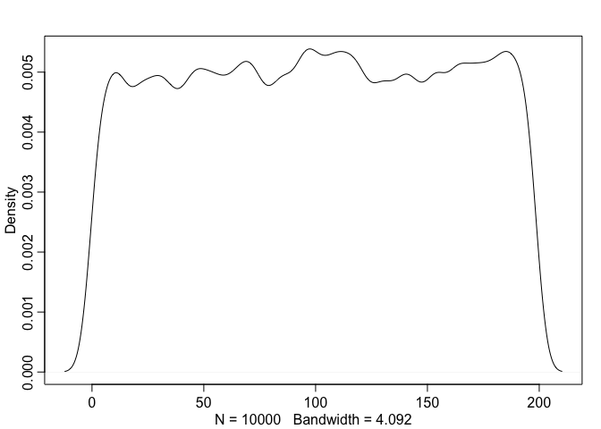

``` r
grid_approx("Mikkel", 66,132) #Mikkel
```

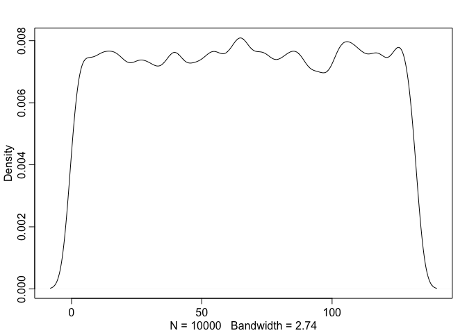

``` r
#Josh is the best
#Riccardo: symmetrical, around 50 but braoder
#Mikkel: symmetrical, around 50 but narrower
```

1.  Change the prior. Given your teachers have all CogSci jobs, you
    should start with a higher appreciation of their knowledge: the
    prior is a normal distribution with a mean of 0.8 and a standard
    deviation of 0.2. Do the results change (and if so how)? 3a. Produce
    plots of the prior and posterior for each teacher.

``` r
#function for prior with 0.8 and sd 0.2
grid_approx1 <- function(teacher_name, teacher_correct, teacher_all){
  p_grid <- seq(from = 0 , to = 1 , length.out = 1e4) #define grid
  prior <- dnorm(p_grid, 0.8, 0.2)
  dens(rbinom(1e4, teacher_all, rnorm(1e4, 0.8, 0.2)))
  likelihood <- dbinom(teacher_correct , size = teacher_all , prob = p_grid)
  unstd.posterior <- likelihood*prior
  bin_size <- bin_size <- abs(p_grid[1] - p_grid[2])
  posterior <- unstd.posterior / sum(unstd.posterior*bin_size)
  d <- data.frame(grid = p_grid, posterior = posterior, prior = prior, likelihood = likelihood)
  ggplot(d, aes(grid,posterior)) + 
      geom_point() +
      geom_line() +
      theme_classic()+ 
      geom_line(aes(grid, prior),color= 'red')+ 
      xlab("Knowledge of CogSci") + 
      ylab("Density") +
      ggtitle(teacher_name)}

grid_approx1("Riccardo", 3, 6) # Ricardo
```

    ## Warning in rbinom(10000, teacher_all, rnorm(10000, 0.8, 0.2)): NAs produced


``` r
grid_approx1("Kristian", 2,2) #Kristian 
```

    ## Warning in rbinom(10000, teacher_all, rnorm(10000, 0.8, 0.2)): NAs produced


``` r
grid_approx1("Josh", 160,198) #Josh
```

    ## Warning in rbinom(10000, teacher_all, rnorm(10000, 0.8, 0.2)): NAs produced

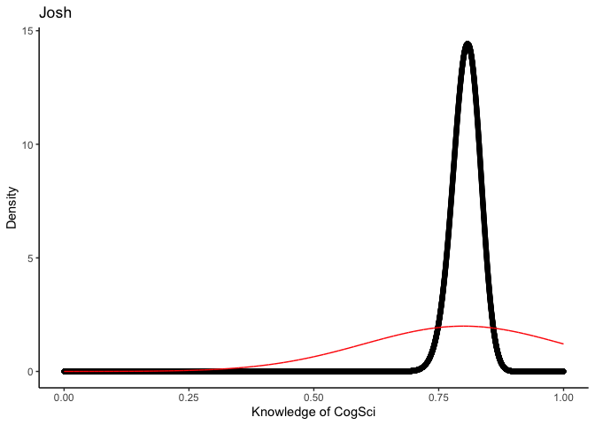

``` r
grid_approx1("Mikkel", 66,132) #Mikkel
```

    ## Warning in rbinom(10000, teacher_all, rnorm(10000, 0.8, 0.2)): NAs produced

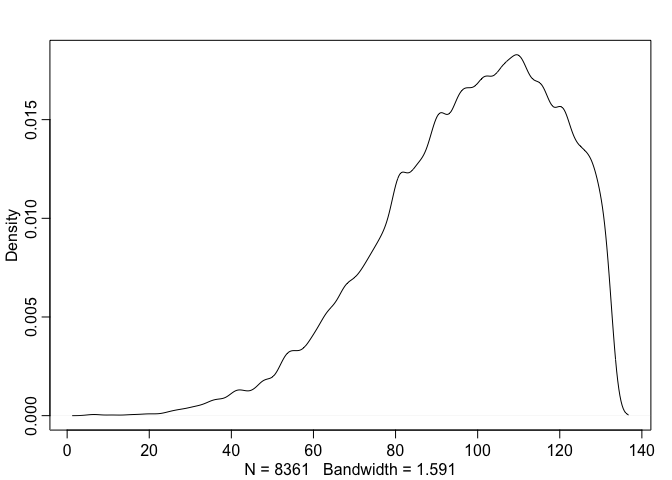

1.  You go back to your teachers and collect more data (multiply the
    previous numbers by 100). Calculate their knowledge with both a
    uniform prior and a normal prior with a mean of 0.8 and a standard
    deviation of 0.2. Do you still see a difference between the results?
    Why?

``` r
#with uniform prior 
grid_approx("Riccardo", 300, 600)
```

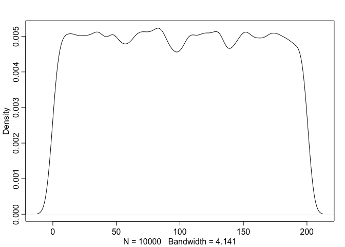

``` r
grid_approx("Kristian", 200,200) 
```

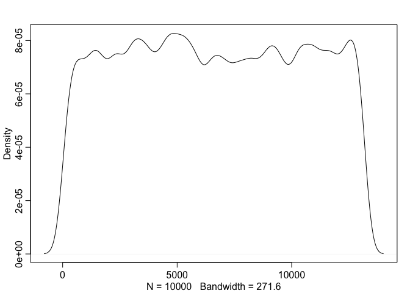

``` r
grid_approx("Josh", 16000,19800) 
```


``` r
grid_approx("Mikkel", 6600,13200) 
```


``` r
#with normal prior of mean = 0.8 and sd = 0.2 
grid_approx1("Riccardo", 300, 600) 
```

    ## Warning in rbinom(10000, teacher_all, rnorm(10000, 0.8, 0.2)): NAs produced

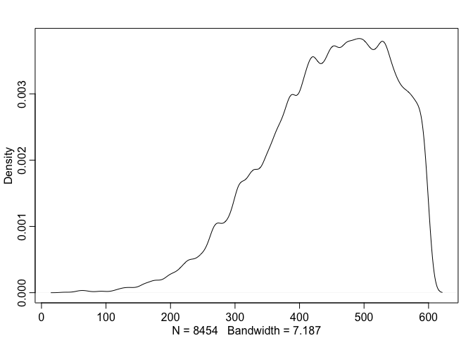

``` r
grid_approx1("Kristian", 200,200) 
```

    ## Warning in rbinom(10000, teacher_all, rnorm(10000, 0.8, 0.2)): NAs produced


``` r
grid_approx1("Josh", 16000,19800) 
```

    ## Warning in rbinom(10000, teacher_all, rnorm(10000, 0.8, 0.2)): NAs produced

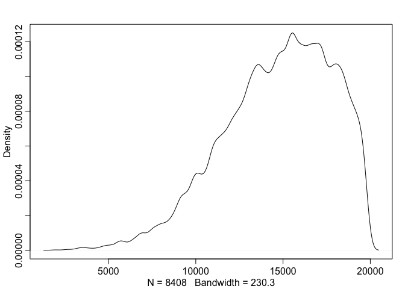

``` r
grid_approx1("Mikkel", 6600,13200) 
```

    ## Warning in rbinom(10000, teacher_all, rnorm(10000, 0.8, 0.2)): NAs produced


``` r
#prior has almost no influence anymore, becasue there is so much data, i.e. they don't differ anymore 
```

1.  Imagine you’re a skeptic and think your teachers do not know
    anything about CogSci, given the content of their classes. How would
    you operationalize that belief?

``` r
#think that my teachers don't know anything: change the prior, so that small values are more likely, i.e. below chance
grid_approx2 <- function(teacher_name, teacher_correct, teacher_all){
  p_grid <- seq(from = 0 , to = 1 , length.out = 1e4) #define grid
  prior <- dnorm(p_grid, 0.2, 0.2)
  dens(rbinom(1e4, teacher_all, rnorm(1e4, 0.2, 0.2)))
  likelihood <- dbinom(teacher_correct , size = teacher_all , prob = p_grid)
  unstd.posterior <- likelihood*prior
  bin_size <- bin_size <- abs(p_grid[1] - p_grid[2])
  posterior <- unstd.posterior / sum(unstd.posterior*bin_size)
  d <- data.frame(grid = p_grid, posterior = posterior, prior = prior, likelihood = likelihood)
  ggplot(d, aes(grid,posterior)) + 
      geom_point() +
      geom_line() +
      theme_classic()+ 
      geom_line(aes(grid, prior),color= 'red')+ 
      xlab("Knowledge of CogSci") + 
      ylab("Density") +
      ggtitle(teacher_name)}

#normal data
grid_approx2("Riccardo", 3, 6)
```

    ## Warning in rbinom(10000, teacher_all, rnorm(10000, 0.2, 0.2)): NAs produced


``` r
grid_approx2("Kristian", 2,2) 
```

    ## Warning in rbinom(10000, teacher_all, rnorm(10000, 0.2, 0.2)): NAs produced


``` r
grid_approx2("Josh", 160,198) 
```

    ## Warning in rbinom(10000, teacher_all, rnorm(10000, 0.2, 0.2)): NAs produced

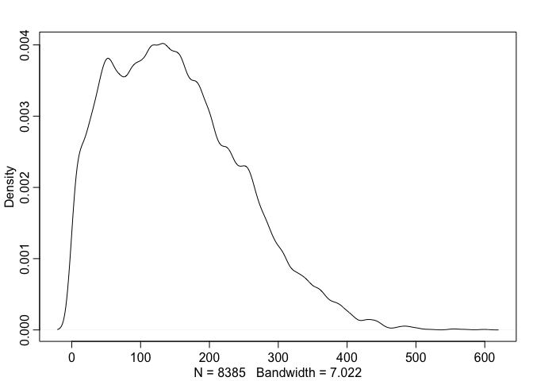

``` r
grid_approx2("Mikkel", 66,132) 
```

    ## Warning in rbinom(10000, teacher_all, rnorm(10000, 0.2, 0.2)): NAs produced


``` r
#more data
grid_approx2("Riccardo", 300, 600)
```

    ## Warning in rbinom(10000, teacher_all, rnorm(10000, 0.2, 0.2)): NAs produced

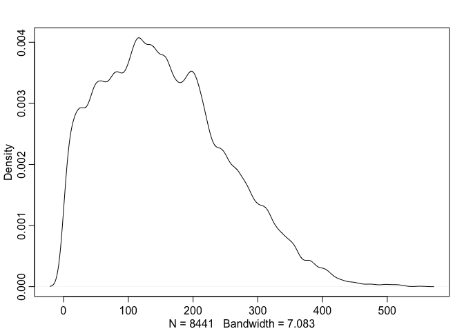

``` r
grid_approx2("Kristian", 200,200) 
```

    ## Warning in rbinom(10000, teacher_all, rnorm(10000, 0.2, 0.2)): NAs produced


``` r
grid_approx2("Josh", 16000,19800) 
```

    ## Warning in rbinom(10000, teacher_all, rnorm(10000, 0.2, 0.2)): NAs produced

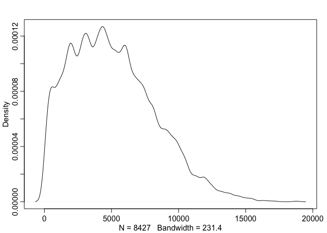

``` r
grid_approx2("Mikkel", 6600,13200) 
```

    ## Warning in rbinom(10000, teacher_all, rnorm(10000, 0.2, 0.2)): NAs produced

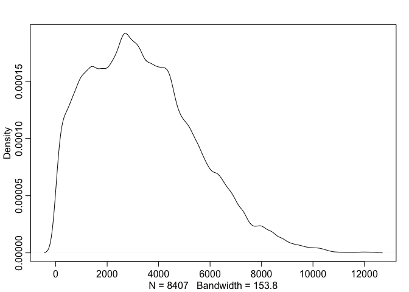

1.  Optional question: Can you estimate the difference between
    Riccardo’s estimated knowledge and that of each of the other
    teachers? Would you deem it credible (that is, would you believe
    that it is actually different)?

2.  Bonus knowledge: all the stuff we have done can be implemented in a
    lme4-like fashion using the brms package. Here is an example.

If you dare, try to tweak the data and model to test two hypotheses: -
Is Kristian different from Josh? - Is Josh different from chance?

### Second part: Focusing on predictions

Last year you assessed the teachers (darned time runs quick!). Now you
want to re-test them and assess whether your models are producing
reliable predictions. In Methods 3 we learned how to do machine-learning
style assessment of predictions (e.g. rmse on testing datasets).
Bayesian stats makes things a bit more complicated. So we’ll try out how
that works. N.B. You can choose which prior to use for the analysis of
last year’s data.

Questions to be answered (but see guidance below): 1- Write a paragraph
discussing how assessment of prediction performance is different in
Bayesian vs. frequentist models 2- Provide at least one plot and one
written line discussing prediction errors for each of the teachers.

This is the old data: - Riccardo: 3 correct answers out of 6 questions -
Kristian: 2 correct answers out of 2 questions (then he gets bored) -
Josh: 160 correct answers out of 198 questions (Josh never gets bored) -
Mikkel: 66 correct answers out of 132 questions

This is the new data: - Riccardo: 9 correct answers out of 10 questions
(then he freaks out about teaching preparation and leaves) - Kristian: 8
correct answers out of 12 questions - Josh: 148 correct answers out of
172 questions (again, Josh never gets bored) - Mikkel: 34 correct
answers out of 65 questions

Guidance Tips

1.  There are at least two ways of assessing predictions.
2.  Last year’s results are this year’s expectations.
3.  Are the parameter estimates changing? (way 1)
4.  How does the new data look in last year’s predictive posterior?
    (way 2)

``` r
#Get Kenneths Functions
#calculations
calc_teacher <- function(n_correct, n_question, prior, length_out = 10000){
  # this function calculate the posterior
  p_grid <- seq(0,1, length.out = length_out)
  likelihood <- dbinom(n_correct, 
                       size = n_question, 
                       prob = p_grid)
  unstd_posterior <- prior * likelihood
  bin_size <- abs(p_grid[1] - p_grid[2])
  posterior <- unstd_posterior/sum(unstd_posterior * bin_size)
  return(list(teacher_posterior = posterior, 
              likelihood = likelihood,
              prior = prior,
              grid = p_grid))
}


#pretty plot 
pretty_plot <- function(p_grid, prior, likelihood, posterior, title = " "){
  # define data
  d <- tibble(p_grid = p_grid, 
              prior = prior, 
              likelihood = likelihood,
              posterior = posterior)
  
  # make to long format
  d <- d %>% 
    pivot_longer(cols = c("prior", "likelihood", "posterior"), names_to = "name", values_to = "value")
  
  # make a 
  p <- ggplot(d, aes(x = p_grid, y = value, color = name)) + 
    geom_line() + 
    labs(x = "x", y = "Density", title = title) + 
    theme_bw() + 
    ggplot2::theme(panel.background = element_rect(fill = "white"),
                   panel.border = element_blank()) +
    scale_colour_brewer(palette = "Dark2", direction = 1)
  return(p)
}

#-------------------------------------------------------------


#CALCULATIONS
#define grid and prior
p_grid <- seq(0,1, length.out = 10000)
prior = dnorm(p_grid, 0.8, 0.2)

#2019 calculations (save posteriors to use as priors in next calculation)
Riccardo2019 <- calc_teacher(n_correct = 3, n_question = 6, prior = prior, length_out = 10000) #first ones 
pretty_plot(p_grid = p_grid, likelihood = Riccardo2019$likelihood, prior = Riccardo2019$prior, posterior = Riccardo2019$teacher_posterior, title = "Riccardo" )
```


``` r
Kristian2019 <- calc_teacher(n_correct = 2, n_question = 2, prior = prior, length_out = 10000) #first ones 
Josh2019 <- calc_teacher(n_correct = 160, n_question = 198, prior = prior, length_out = 10000) #first ones 
Mikkel2019 <- calc_teacher(n_correct = 66, n_question = 132, prior = prior, length_out = 10000) #first ones 

#2020 calculations, using 2019 posteriors as prior
Riccardo2020 <- calc_teacher(n_correct = 9, n_question = 10, prior = Riccardo2019$teacher_posterior, length_out = 10000)
Kristian2020 <- calc_teacher(n_correct = 8, n_question = 12, prior = Kristian2019$teacher_posterior, length_out = 10000) 
Josh2020 <- calc_teacher(n_correct = 148, n_question = 172, prior = Josh2019$teacher_posterior, length_out = 10000) 
Mikkel2020 <- calc_teacher(n_correct = 34, n_question = 65, prior = Mikkel2019$teacher_posterior, length_out = 10000)  


#PLOTS
#Riccardo
pretty_plot(p_grid = p_grid, prior = Riccardo2020$prior, likelihood = Riccardo2020$likelihood, posterior = Riccardo2020$teacher_posterior, title = "Riccardo")
```


``` r
#Kristian 
pretty_plot(p_grid = p_grid, prior = Kristian2020$prior, likelihood = Kristian2020$likelihood, posterior = Kristian2020$teacher_posterior, title = "Kristian")
```


``` r
#Josh 
pretty_plot(p_grid = p_grid, prior = Josh2020$prior, likelihood = Josh2020$likelihood, posterior = Josh2020$teacher_posterior, title = "Josh")
```

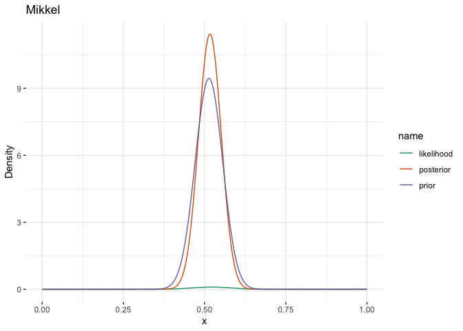

``` r
#Mikkel
pretty_plot(p_grid = p_grid, prior = Mikkel2020$prior, likelihood = Mikkel2020$likelihood, posterior = Mikkel2020$teacher_posterior, title = "Mikkel")
```


``` r
#Difference of Riccardo 2020 posterior and 2019 posterior
diff_post <- abs(Riccardo2020$teacher_posterior-Riccardo2019$teacher_posterior)
plot(diff_post)
```


``` r
#CALCULATE MEAN AND SD FOR POSTERIOR DISTRIBUTIONS 
#2019
#Riccardo
samples <- sample(Riccardo2019$grid , prob = Riccardo2019$teacher_posterior, size = 1e4 , replace = TRUE)
round(mean(samples), 3) #mean of posterior
```

    ## [1] 0.628

``` r
sd <- round(sd(samples), 3) #sd of posterior

#Kristian
samples <- sample(Kristian2019$grid , prob = Kristian2019$teacher_posterior, size = 1e4 , replace = TRUE)
round(mean(samples), 3) #mean of posterior
```

    ## [1] 0.802

``` r
round(sd(samples), 3) #sd of posterior
```

    ## [1] 0.133

``` r
#Josh 
samples <- sample(Josh2019$grid , prob = Josh2019$teacher_posterior, size = 1e4 , replace = TRUE)
round(mean(samples), 3) #mean of posterior
```

    ## [1] 0.804

``` r
round(sd(samples), 3) #sd of posterior
```

    ## [1] 0.028

``` r
#Mikkel
samples <- sample(Mikkel2019$grid , prob = Mikkel2019$teacher_posterior, size = 1e4 , replace = TRUE)
round(mean(samples), 3) #mean of posterior
```

    ## [1] 0.513

``` r
round(sd(samples), 3) #sd of posterior
```

    ## [1] 0.042

``` r
#2020
#Riccardo
samples <- sample(Riccardo2020$grid , prob = Riccardo2020$teacher_posterior, size = 1e4 , replace = TRUE)
round(mean(samples), 3) #mean of posterior
```

    ## [1] 0.744

``` r
sd <- round(sd(samples), 3) #sd of posterior

#Kristian
samples <- sample(Kristian2020$grid , prob = Kristian2020$teacher_posterior, size = 1e4 , replace = TRUE)
round(mean(samples), 3) #mean of posterior
```

    ## [1] 0.718

``` r
round(sd(samples), 3) #sd of posterior
```

    ## [1] 0.095

``` r
#Josh 
samples <- sample(Josh2020$grid , prob = Josh2020$teacher_posterior, size = 1e4 , replace = TRUE)
round(mean(samples), 3) #mean of posterior
```

    ## [1] 0.83

``` r
round(sd(samples), 3) #sd of posterior
```

    ## [1] 0.019

``` r
#Mikkel
samples <- sample(Mikkel2020$grid , prob = Mikkel2020$teacher_posterior, size = 1e4 , replace = TRUE)
round(mean(samples), 3) #mean of posterior
```

    ## [1] 0.515

``` r
round(sd(samples), 3) #sd of posterior
```

    ## [1] 0.035

``` r
#PREDICTIVE POSTERIOR AND PREDICTION ERRORS
#Comparing predictions from 2019 to new values from 2020
#Riccardo: in 2020 got 9/10
samples <- sample(Riccardo2019$grid , prob = Riccardo2019$teacher_posterior, size = 1e4 , replace = TRUE)
#generate predictions 
post_pred <- rbinom(1e4 , size = 10 , prob = samples)
#histogram of predictions
simplehist(post_pred, xlab = "Number of Correct Answers", main = "Riccardo")
```


``` r
#prediction errors
simplehist(post_pred-9, main = "Riccardo: Prediction Error for 9/10 Questions", xlab = "Prediction Error")
```


``` r
#calcualting precentage of chance of getting 2020 values based on 2019 posterior
sum(post_pred == 9)/1e4*100 #exactly 9
```

    ## [1] 9.4

``` r
sum(post_pred >= 9-1 & post_pred <= 9+1)/1e4*100 #between 8 and 10
```

    ## [1] 28.28

``` r
#Kristian: in 2020 got 8/12
samples <- sample(Kristian2019$grid , prob = Kristian2019$teacher_posterior , size=1e4 , replace=TRUE )
post_pred <- rbinom(1e4 , size= 12 , prob = samples)
#histogram of predictions
simplehist(post_pred, xlab = "Number of Correct Answers", main = "Kristian")
```

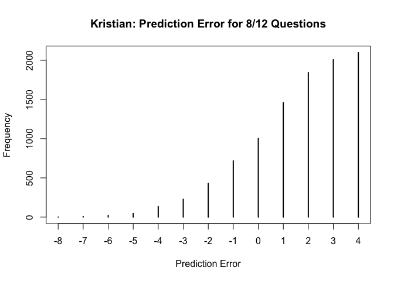

``` r
#prediction errors
simplehist(post_pred-8, main = "Kristian: Prediction Error for 8/12 Questions", xlab = "Prediction Error")
```


``` r
#calcualting precentage of chance of getting 2020 values based on 2019 posterior
sum(post_pred == 8)/1e4*100
```

    ## [1] 10.6

``` r
sum(post_pred >= 8-1 & post_pred <= 8+1)/1e4*100
```

    ## [1] 31.8

``` r
#Josh: in 2020 got 148/172
samples <- sample(Josh2019$grid , prob = Josh2019$teacher_posterior , size=1e4 , replace=TRUE )
post_pred <- rbinom(1e4 , size= 172 , prob = samples)
#histogram of predictions
simplehist(post_pred, xlab = "Number of Correct Answers", main = "Josh")
```


``` r
#prediction errors
simplehist(post_pred-148, main = "Josh: Prediction Error for 148/172 Questions", xlab = "Prediction Error")
```

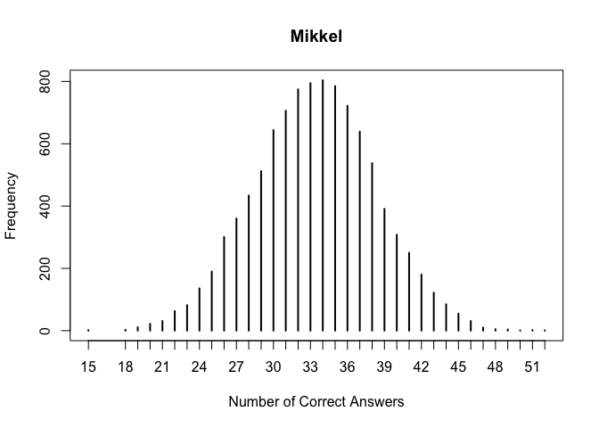

``` r
#calcualting precentage of chance of getting 2020 values based on 2019 posterior
sum(post_pred == 148)/1e4*100
```

    ## [1] 2.55

``` r
sum(post_pred >= 148-3 & post_pred <= 148+3)/1e4*100
```

    ## [1] 16.93

``` r
#Mikkel: in 2020 got 34/65
samples <- sample(Mikkel2019$grid , prob = Mikkel2019$teacher_posterior , size=1e4 , replace=TRUE )
post_pred <- rbinom(1e4 , size= 65 , prob = samples)
#histogram of predictions
simplehist(post_pred, xlab = "Number of Correct Answers", main = "Mikkel")
```


``` r
#prediction errors
simplehist(post_pred-34, main = "Mikkel: Prediction Error for 34/65 Questions", xlab = "Prediction Error")
```

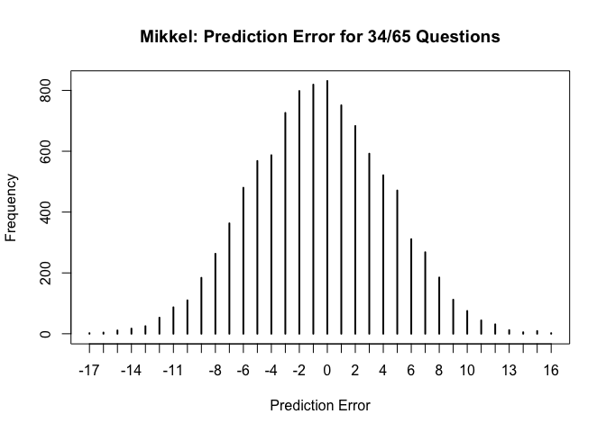

``` r
#calcualting precentage of chance of getting 2020 values based on 2019 posterior
sum(post_pred == 34)/1e4*100
```

    ## [1] 8.31

``` r
sum(post_pred >= 34-2 & post_pred <= 34+2)/1e4*100
```

    ## [1] 38.82
